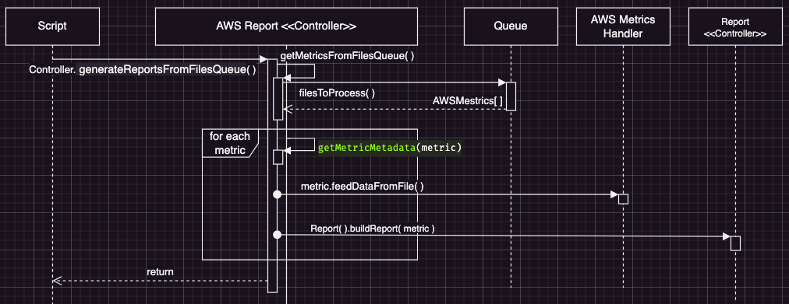
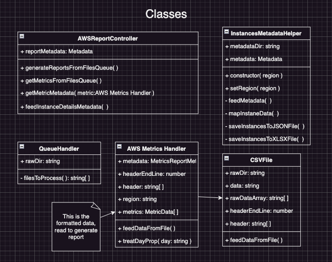
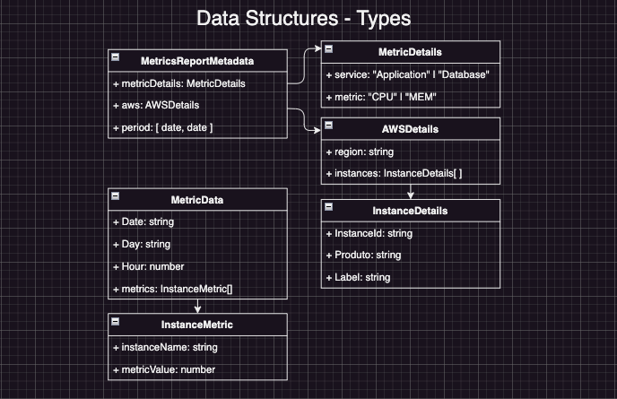

# AWS Capacity Report handler
This tool must help AWS metrics reports generation to performance analysis.

### Running the project
With **nodeJS** installed, execute the commands:
- To install dependencies `` npm install ``
- Then run with `` npm start `` after set directories to **raw CSV files**, metadata - `MetricsByDashboardName` map and `AWSDetails` to **outputReport**.
   !! Theses paths are hard coded for now !!

---

# Development context
Recently changed from Laravel/Angular dev into DevOps, where most of our infrastructure are on AWS. There is a report used to keep track of our server's instances performance metrics, today this report is done manually.
#### 😮‍💨 Building report manually
AWS CPU and Memory metrics data are extracted from a dashboards as CSV reports, so they are formatted: numbers fixed and business period filtered. Data is pasted into a sheet with instances label as header, when all days of the week are completed, the week report is compiled with day's data.  

## How does it work?
Data from CSV file is treated, filtered by business work time and grouped by day and XLSX workbook is generated, a sheet / day.
   - *Week data processing to be developed*

- Simplistic sequence diagram of data flow. Async methods to return data within these shown methods need to be improved.

**Main structures**
|  |  |
| --- | --- |

| Class | Functionally |
| --- |     ---    |
`Queue` | Read raw files directory to get files queue. |
`AWS File Handler` | Process data from CSV and format into treated data to report generation. |
| `AWS Metrics Controller` | Controls the workflow: **Files on queue** > Get **environment Metadata** > **Process and format CSV** to get metrics data > **Build/update XLSX reports**
| `Report` | Generate the output XLSX from metrics `formattedData`

---

📌 I'm trying to improve tasks/development tracking, also mapping identified **technical debts** to further improvements.
Change logs bellow is an overview to development workflow changes so far.

## Change Logs
---
#### **→ 06 - 11 Feb 2023**
#### **→ 30 Jan - 03 Feb 2023**
- Refactoring, the AWSMetricsFileHandler, csv handler, maps all data then services will be able to handle it.
- Persisting data on database - Metrics & Instances
- Updating structures - database models, data types, services & handlers.
   - Updating docs

#### **→ 23 - 27 Jan 2023**
Created **AWS Metrics Report Controller** which basically is instantiated by main script and runs the workflows:
→ Map metrics from files on queue and generate reports from grouped data   - Created `InstancesMetadataHelper` → Attempts to fetch AWS instances details with AWS SDK because instances IDs on CSV files don't match with XLSX .
- Async data was fixed, improving formatted data and  data structures.
   -  Fixed instance metadata handling.
   To fix some technical debts from data fetching Promises.
-  Mapped dashboards name and its specificities.
-  Improving data structures, isolating types.
-  Creating remote repository
-  Improving async calls on workflow, so metrics data can be mapped with instances label. Some issues dealing async calls on dataflow

-  Created `readme.md` with project details and **change logs**.
- `AWSFileHandler` → Improved getters to header, region and content from raw data.
#### **→ 16 - 20 Jan 2023**
- Converting code to typescript usage to use type hints and study more about its usage.
   - Create `Queue` & `Report` handlers, and `MetricsCSVFile` to read, process and return formatted data.
   - Converted elements to a rough class, intend to clean **process work** from **data structures.** Having trouble with async requests to read raw CSV reports. When `Metric` is passed to report generation, it still doesn’t have data to be formatted.
- Some CSV file handling was abstracted and `MetricsCSVFile` is `AWSFileHandler`, handling data and formatting day props. Improved methods of typing.

- Attempts to fetch AWS metrics details with AWS SDK
- Working on AWS instances metadata getter. It will be used to identify metric specificity. Attempting to map instances from the XLSM report given.

- Refactoring structures to isolate responsibilities. Treating async calls errors and types conflicts.
   - Created **Classes diagram** and **Data structures** to ease visualization.